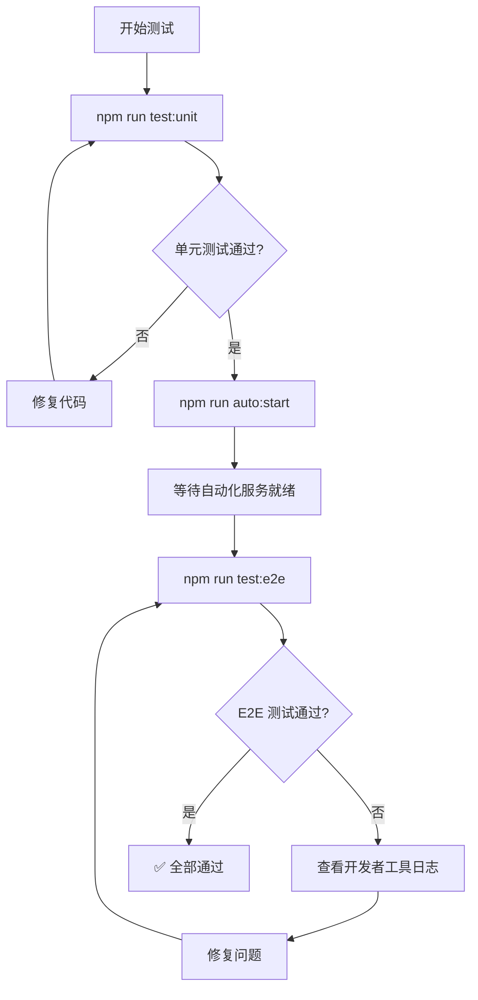

# 微信小程序自动化测试指南

> 基于 `miniprogram-automator` + `Jest` 的小程序自动化测试完整总结

---

## 目录

- [1. 概述](#1-概述)
- [2. miniprogram-automator 核心概念](#2-miniprogram-automator-核心概念)
- [3. 环境搭建](#3-环境搭建)
- [4. 连接模式](#4-连接模式)
- [5. 核心 API 详解](#5-核心-api-详解)
- [6. 单元测试](#6-单元测试)
- [7. E2E 测试](#7-e2e-测试)
- [8. 常见问题与排错](#8-常见问题与排错)
- [9. 最佳实践](#9-最佳实践)

---

## 1. 概述

微信小程序自动化测试分为两个层次：

| 层次         | 工具                         | 作用                                   | 速度       |
| ------------ | ---------------------------- | -------------------------------------- | ---------- |
| **单元测试** | Jest + Mock                  | 测试纯逻辑（工具函数、云函数业务逻辑） | 快（~1s）  |
| **E2E 测试** | miniprogram-automator + Jest | 驱动微信开发者工具进行真实页面交互     | 慢（~35s） |

**miniprogram-automator** 是微信官方提供的小程序自动化 SDK，能够：
- 控制小程序的页面跳转、元素点击、输入等操作
- 获取页面数据（`data`）、元素属性、WXML 结构
- 模拟真实用户操作流程，验证端到端功能

---

## 2. miniprogram-automator 核心概念

### 2.1 架构原理

```
┌──────────────┐    WebSocket     ┌──────────────────────┐
│  测试脚本     │ ◄──────────────► │  微信开发者工具       │
│  (Node.js)   │   ws://9420      │  (自动化服务端)       │
│  automator   │                  │  运行小程序实例       │
└──────────────┘                  └──────────────────────┘
```

- 测试脚本通过 **WebSocket** 与微信开发者工具通信
- 开发者工具需要先通过 CLI 启动 **自动化服务**（`cli auto` 命令）
- 测试脚本通过 `automator.connect()` 连接到自动化服务

### 2.2 核心对象层级

```
automator                    # 入口，负责连接/启动
  └── MiniProgram            # 小程序实例
        ├── .navigateTo()    # 页面跳转
        ├── .switchTab()     # Tab 切换
        ├── .currentPage()   # 获取当前页面
        └── Page             # 页面实例
              ├── .data()    # 获取页面数据
              ├── .$()       # 查询单个元素
              ├── .$$()      # 查询多个元素
              └── Element    # 元素实例
                    ├── .tap()        # 点击
                    ├── .input()      # 输入
                    ├── .attribute()  # 获取属性
                    └── .text()       # 获取文本
```

---

## 3. 环境搭建

### 3.1 安装依赖

```bash
npm install --save-dev jest miniprogram-automator
```

对应 `package.json`：

```json
{
  "devDependencies": {
    "jest": "^29.7.0",
    "miniprogram-automator": "^0.12.1"
  }
}
```

### 3.2 Jest 配置

```json
{
  "jest": {
    "testEnvironment": "node",
    "testMatch": ["**/tests/**/*.test.js"],
    "testTimeout": 60000
  }
}
```

> **注意**：E2E 测试涉及网络通信和页面渲染，`testTimeout` 建议设为 60000ms（60秒）。

### 3.3 npm scripts

```json
{
  "scripts": {
    "test:unit": "jest --testPathPattern=tests/unit",
    "test:e2e": "jest --testPathPattern=tests/e2e --runInBand",
    "auto:start": "node start-auto.js",
    "postinstall": "node patch-automator.js"
  }
}
```

- `--runInBand`：E2E 测试必须串行执行（共享同一个开发者工具实例）
- `postinstall`：安装依赖后自动执行兼容性补丁

### 3.4 开发者工具配置

1. 打开微信开发者工具
2. **设置 → 安全 → 开启服务端口** ✓
3. 确保项目已正确加载

---

## 4. 连接模式

miniprogram-automator 支持两种模式：

### 4.1 launch 模式（启动新实例）

```js
const automator = require('miniprogram-automator');

const miniProgram = await automator.launch({
  cliPath: 'D:/微信web开发者工具/cli.bat',  // 开发者工具 CLI 路径
  projectPath: '/path/to/project',           // 小程序项目路径
});
```

### 4.2 connect 模式（连接已有实例）⭐ 推荐

先通过 CLI 启动自动化服务：

```bash
# start-auto.js 的等价命令
"D:/微信web开发者工具/cli.bat" auto --project <项目路径> --auto-port 9420
```

然后在测试脚本中连接：

```js
const automator = require('miniprogram-automator');

const miniProgram = await automator.connect({
  wsEndpoint: 'ws://127.0.0.1:9420',
});
```

**推荐 connect 模式的原因**：
- 自动化服务只需启动一次，多次运行测试无需重启
- 避免每次测试都冷启动开发者工具（节省 10-20 秒）
- 更稳定，不受开发者工具启动时序影响

---

## 5. 核心 API 详解

### 5.1 MiniProgram 对象

| 方法              | 说明                       | 示例                                                         |
| ----------------- | -------------------------- | ------------------------------------------------------------ |
| `navigateTo(url)` | 跳转到非 tabBar 页面       | `await miniProgram.navigateTo('/pages/group/create/create')` |
| `switchTab(url)`  | 切换到 tabBar 页面         | `await miniProgram.switchTab('/pages/group/list/list')`      |
| `reLaunch(url)`   | 关闭所有页面，打开指定页面 | `await miniProgram.reLaunch('/pages/index/index')`           |
| `redirectTo(url)` | 关闭当前页，跳转到指定页面 | `await miniProgram.redirectTo('/pages/login/login')`         |
| `navigateBack()`  | 返回上一页                 | `await miniProgram.navigateBack()`                           |
| `currentPage()`   | 获取当前页面实例           | `const page = await miniProgram.currentPage()`               |
| `pageStack()`     | 获取页面栈                 | `const stack = await miniProgram.pageStack()`                |
| `close()`         | 关闭自动化连接             | `await miniProgram.close()`                                  |

**注意事项**：
- `navigateTo` **不能**跳转到 tabBar 页面，否则报错 `can not navigateTo a tabbar page`
- tabBar 页面必须使用 `switchTab`
- 跳转后需要 `await sleep(ms)` 等待页面渲染完成

### 5.2 Page 对象

| 方法                          | 说明          | 示例                                             |
| ----------------------------- | ------------- | ------------------------------------------------ |
| `page.path`                   | 页面路径      | `expect(page.path).toContain('group/create')`    |
| `page.data()`                 | 获取页面 data | `const data = await page.data()`                 |
| `page.setData(data)`          | 设置页面 data | `await page.setData({ name: 'test' })`           |
| `page.callMethod(name, args)` | 调用页面方法  | `await page.callMethod('onLoad', { id: '123' })` |
| `page.$(selector)`            | 查询单个元素  | `const btn = await page.$('.btn-primary')`       |
| `page.$$(selector)`           | 查询多个元素  | `const items = await page.$$('.list-item')`      |

### 5.3 Element 对象

| 方法                        | 说明                       | 示例                                               |
| --------------------------- | -------------------------- | -------------------------------------------------- |
| `el.tap()`                  | 点击元素                   | `await btn.tap()`                                  |
| `el.longpress()`            | 长按元素                   | `await el.longpress()`                             |
| `el.input(text)`            | 输入文本（input/textarea） | `await input.input('测试文本')`                    |
| `el.text()`                 | 获取元素文本内容           | `const text = await el.text()`                     |
| `el.attribute(name)`        | 获取元素属性               | `const disabled = await btn.attribute('disabled')` |
| `el.property(name)`         | 获取元素属性（JS 属性）    | `const value = await el.property('value')`         |
| `el.wxml()`                 | 获取元素 WXML 结构         | `const wxml = await el.wxml()`                     |
| `el.outerWxml()`            | 获取元素外层 WXML          | `const outer = await el.outerWxml()`               |
| `el.offset()`               | 获取元素位置和尺寸         | `const { left, top } = await el.offset()`          |
| `el.trigger(event, detail)` | 触发自定义事件             | `await el.trigger('change', { value: 1 })`         |

### 5.4 选择器语法

miniprogram-automator 支持的选择器与小程序 WXML 选择器一致：

```js
// 类选择器
await page.$('.btn-primary')

// ID 选择器
await page.$('#submit-btn')

// 标签选择器
await page.$('button')

// 组合选择器
await page.$('.form .input-field')

// 自定义组件
await page.$('loading')  // 对应 <loading> 组件
```

---

## 6. 单元测试

### 6.1 适用场景

单元测试适合测试**不依赖微信运行时**的纯逻辑：

- 工具函数（日期格式化、邀请码生成、积分计算等）
- 云函数核心业务逻辑（权限校验、数据处理）
- 数据转换和验证函数

### 6.2 Mock 微信全局对象

小程序代码中常用 `wx.xxx` API，在 Node.js 环境中需要 mock：

```js
// 测试文件顶部
global.wx = {
  showToast: jest.fn(),
  showLoading: jest.fn(),
  hideLoading: jest.fn(),
};
```

### 6.3 Mock wx-server-sdk（云函数测试）

云函数依赖 `wx-server-sdk`，需要创建 mock 文件：

```
tests/unit/__mocks__/wx-server-sdk.js
```

核心思路：模拟 `cloud.database()` 返回的链式调用：

```js
const mockCloud = {
  init: jest.fn(),
  DYNAMIC_CURRENT_ENV: 'mock-env',
  getWXContext: jest.fn(() => ({ OPENID: 'mock_openid' })),
  database: jest.fn(() => createMockDb()),
};

module.exports = mockCloud;
```

然后在测试中使用 `jest.mock('wx-server-sdk')` 自动加载 mock。

### 6.4 单元测试示例

```js
describe('calcPoints - 积分计算', () => {
  it('盈利：结算 > 初始', () => {
    expect(calcPoints(1200, 1000, 200, false)).toBe(200);
  });

  it('额外加成计入总积分', () => {
    expect(calcPoints(1200, 1000, 200, true)).toBe(400);
  });

  it('边界：finalChips 为 null 时视为 0', () => {
    expect(calcPoints(null, 1000, 0, false)).toBe(-1000);
  });
});
```

---

## 7. E2E 测试

### 7.1 测试文件结构

```
tests/
├── e2e/
│   ├── setup.js          # automator 连接配置（单例模式）
│   ├── group.test.js     # 记分组功能 E2E
│   └── match.test.js     # 赛程+分数 E2E
└── unit/
    ├── __mocks__/
    │   └── wx-server-sdk.js
    ├── utils.test.js
    └── cloudfunctions.test.js
```

### 7.2 setup.js — 连接管理（单例模式）

```js
const automator = require('miniprogram-automator');

let miniProgram = null;

async function getMiniProgram() {
  if (miniProgram) return miniProgram;
  miniProgram = await automator.connect({
    wsEndpoint: `ws://127.0.0.1:9420`,
  });
  return miniProgram;
}

async function closeMiniProgram() {
  if (miniProgram) {
    try { await miniProgram.close(); } catch (_) {}
    miniProgram = null;
  }
}

module.exports = { getMiniProgram, closeMiniProgram };
```

**关键设计**：
- 使用**单例模式**，所有测试共享同一个 miniProgram 实例
- `beforeAll` 中获取连接，`afterAll` 中关闭
- 避免每个测试用例都重新连接（耗时且不稳定）

### 7.3 E2E 测试编写模式

```js
const { getMiniProgram, closeMiniProgram } = require('./setup');
const sleep = (ms) => new Promise(resolve => setTimeout(resolve, ms));

describe('功能模块 E2E', () => {
  let miniProgram;

  beforeAll(async () => {
    miniProgram = await getMiniProgram();
  }, 30000);

  afterAll(async () => {
    await closeMiniProgram();
  });

  it('应能进入目标页面', async () => {
    const page = await miniProgram.navigateTo('/pages/xxx/xxx');
    await sleep(1000);  // 等待页面渲染

    const currentPage = await miniProgram.currentPage();
    expect(currentPage.path).toContain('xxx');
  }, 15000);

  it('输入后数据绑定正确', async () => {
    const page = await miniProgram.navigateTo('/pages/xxx/xxx');
    await sleep(500);

    const input = await page.$('.input-field');
    await input.input('测试文本');
    await sleep(500);

    const data = await page.data();
    expect(data.fieldName).toBe('测试文本');
  }, 15000);

  it('提交后应跳转', async () => {
    const page = await miniProgram.navigateTo('/pages/xxx/xxx');
    await sleep(500);

    // 填写表单
    const input = await page.$('.input-field');
    await input.input('测试数据');
    await sleep(300);

    // 点击提交
    const btn = await page.$('.btn-primary');
    await btn.tap();

    // 等待云函数调用和页面跳转
    await sleep(4000);

    const currentPage = await miniProgram.currentPage();
    expect(currentPage.path).toContain('target-page');
  }, 25000);
});
```

### 7.4 处理登录态

小程序通常有登录拦截，E2E 测试需要考虑：

```js
it('应能切换到列表页（或被重定向到登录页）', async () => {
  try {
    await miniProgram.switchTab('/pages/group/list/list');
  } catch (e) {
    // switchTab 可能因登录拦截而失败，属于正常业务逻辑
  }
  await sleep(1000);

  const currentPage = await miniProgram.currentPage();
  // 已登录 → group/list，未登录 → login
  const validPaths = ['group/list', 'login'];
  const isValid = validPaths.some(p => currentPage.path.includes(p));
  expect(isValid).toBe(true);
});
```

### 7.5 通过环境变量传递测试数据

```bash
TEST_GROUP_ID=xxx TEST_MATCH_ID=yyy npm run test:e2e
```

```js
const TEST_GROUP_ID = process.env.TEST_GROUP_ID || '';

it('需要特定数据的测试', async () => {
  if (!TEST_GROUP_ID) {
    console.warn('跳过：未设置 TEST_GROUP_ID');
    return;
  }
  // ... 测试逻辑
});
```

---

## 8. 常见问题与排错

### 8.1 错误速查表

| 错误信息                                   | 原因                           | 解决方案                          |
| ------------------------------------------ | ------------------------------ | --------------------------------- |
| `Wechat web devTools not found`            | CLI 路径错误                   | 检查 `setup.js` 中 `CLI_PATH`     |
| `Failed connecting to ws://127.0.0.1:9420` | 自动化进程未启动               | 运行 `npm run auto:start`         |
| `can not navigateTo a tabbar page`         | 用 `navigateTo` 访问 tabbar 页 | 改用 `switchTab`                  |
| `timeout waiting for automator response`   | 页面加载超时                   | 增加 sleep 时间或检查登录态       |
| `split` 报错                               | automator 版本兼容问题         | 运行 `node patch-automator.js`    |
| `在项目根目录未找到 app.json`              | 项目路径不正确                 | 确认 `--project` 使用绝对路径     |
| `INVOKE_SERVICE timeout after 300000ms`    | 渲染进程无响应                 | 重启开发者工具，重新 `auto:start` |

### 8.2 automator 版本兼容补丁

`miniprogram-automator` 在某些版本的开发者工具中，`checkVersion` 方法会因 `SDKVersion` 为 `undefined` 而报 `split` 错误。解决方案是通过 `patch-automator.js` 修补：

```js
// 核心逻辑：将 SDKVersion 的 undefined 安全处理
const info = await this.send("Tool.getInfo");
t = info.SDKVersion || "dev";  // 兜底为 "dev"
```

通过 `postinstall` 钩子在 `npm install` 后自动执行。

### 8.3 读取开发者工具日志

E2E 报错时，优先查看开发者工具日志：

```
日志目录：C:\Users\<用户名>\AppData\Local\微信开发者工具\User Data\<ID>\WeappLog\logs\
```

筛选 `[ERROR]` 级别日志即可快速定位问题。

---

## 9. 最佳实践

### 9.1 测试分层策略

```
                    ┌─────────────┐
                    │   E2E 测试   │  ← 少量，验证核心流程
                    │  (automator) │
                   ┌┴─────────────┴┐
                   │   单元测试      │  ← 大量，覆盖业务逻辑
                   │   (Jest mock)  │
                  ┌┴───────────────┴┐
                  │   类型检查/Lint   │  ← 静态分析
                  └─────────────────┘
```

- **单元测试**：覆盖所有工具函数、计算逻辑、校验规则（快速、稳定）
- **E2E 测试**：只覆盖核心用户流程（创建、提交、跳转）（慢、依赖环境）

### 9.2 E2E 测试编写原则

1. **充足的等待时间**：页面跳转后 `sleep(1000)`，云函数调用后 `sleep(3000-5000)`
2. **容错断言**：考虑登录态影响，使用 `validPaths` 多路径匹配
3. **环境变量驱动**：测试数据通过环境变量传入，不硬编码
4. **单例连接**：所有测试共享一个 miniProgram 实例
5. **串行执行**：使用 `--runInBand` 避免并发冲突
6. **独立超时**：每个用例设置独立的 timeout（第二个参数）

### 9.3 云函数测试策略

- **不直接测试云函数入口**（依赖太多），而是**提取核心逻辑**独立测试
- 使用 `__mocks__` 目录自动 mock `wx-server-sdk`
- 模拟数据库的链式调用（`collection().doc().get()`）

### 9.4 项目目录规范

```
项目根目录/
├── tests/
│   ├── e2e/
│   │   ├── setup.js              # automator 连接配置
│   │   └── *.test.js             # E2E 测试用例
│   └── unit/
│       ├── __mocks__/            # Jest 自动 mock 目录
│       │   └── wx-server-sdk.js  # 云函数 SDK mock
│       └── *.test.js             # 单元测试用例
├── patch-automator.js            # automator 兼容性补丁
├── start-auto.js                 # 自动化服务启动脚本
└── package.json                  # 测试脚本和依赖配置
```

### 9.5 运行流程



---

## 附录：miniprogram-automator 官方资源

- **npm 包**：[miniprogram-automator](https://www.npmjs.com/package/miniprogram-automator)
- **官方文档**：[小程序自动化](https://developers.weixin.qq.com/miniprogram/dev/devtools/auto/)
- **API 参考**：
  - [automator](https://developers.weixin.qq.com/miniprogram/dev/devtools/auto/automator.html)
  - [MiniProgram](https://developers.weixin.qq.com/miniprogram/dev/devtools/auto/miniprogram.html)
  - [Page](https://developers.weixin.qq.com/miniprogram/dev/devtools/auto/page.html)
  - [Element](https://developers.weixin.qq.com/miniprogram/dev/devtools/auto/element.html)
